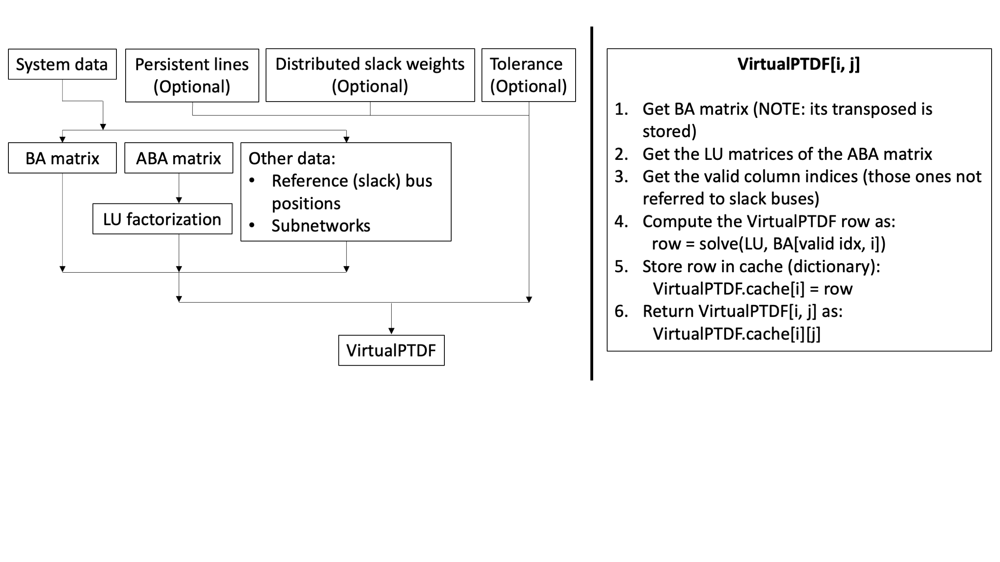

# VirtualPTDF

Contrary to the traditional `PTDF` matrix, the `VirtualPTDF` is a stucture contatining rows of the original matrix, related to specific system branches.
The different rows of the `PTDF` matrix are cached in the `VirtualPTDF` structure as they are evaluated. This allows to keep just the portion of the original matrix which is of interest to the user, avoiding the unecessary computation of the whole matrix.

Refer to the different arguments of the `VirtualPTDF` methods by looking at the "Public API Reference" page.

## How the `VirtualPTDF` works

The `VirtualPTDF` is a structure containing everything needed to compute any row of the PTDF matrix and store it. To do so, the `VirtualPTDF` must store the BA matrix (coming from the `BA_Matrix` struct) and the inverse of the ABA matrix (coming from `ABA_MAtrix` struct). In particular, `KLU` is used to get the LU factorization matrices of the ABA matrix and these ones are stored, avoid the inversion.

Once the `VirtualPTDF` is initialized, each row of the PTDF matrix can be evaluated separately. The algorithmic procedure is the following:
1. Define the `VirtualPTDF` structure
2. Call any element of the matrix to define and store the relative row as well as showing the selected element

Regarding point 2, if the row has been stored previosly then the desired element is just loaded from the cache and shown.

The flowchart below shows how the `VirtualPTDF` is structured and how it works. Examples will be presented in the following sections.

```@raw html

```

## Evaluate or access a `VirtualPTDF` row/element

## `VirtualPTDF` with distributed slack bus

## "Sparse" `VirtualPTDF`